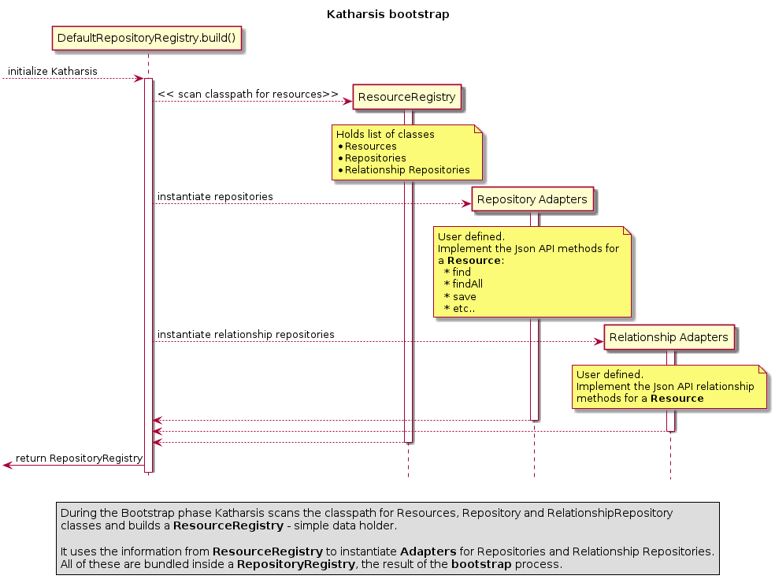
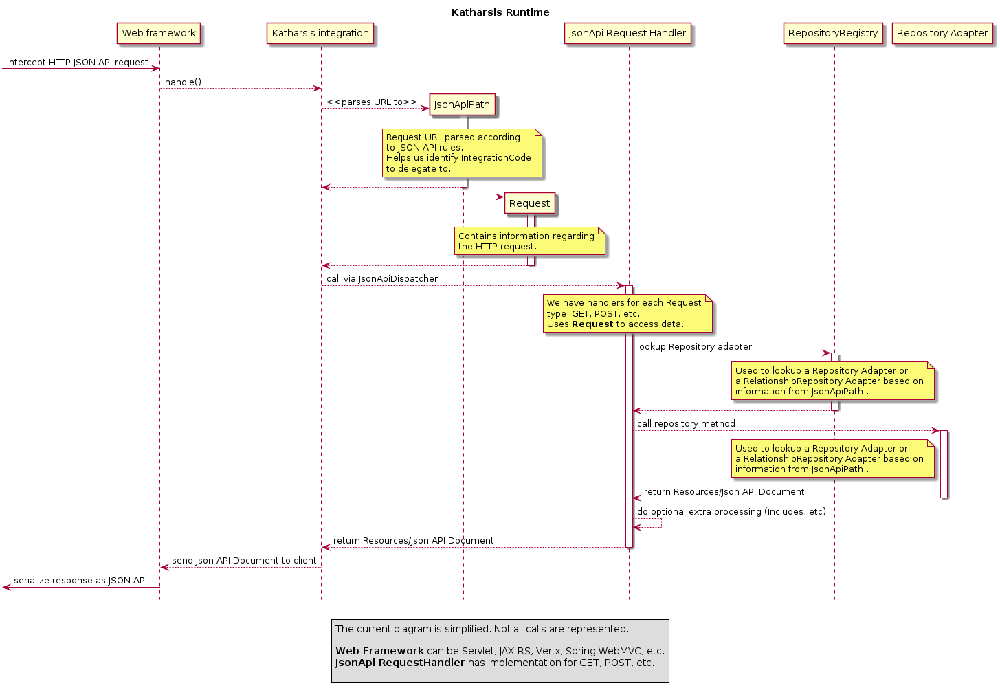

Katharsis design and architecture
=================================

This document describes how Katharsis works, when and how it does certain actions.

What does Katharsis do?
-----------------------

Katharsis is a library that implements `json api`_ specification.
It processes ``HTTP`` web requests in `json api`_ format and sends back responses conforming to the same specification.

You can use it to add `json api`_ support to your web applications and build ``API``'s.

Currently, you can use Katharsis to build servers and you can't use it to make requests to other `json api`_ servers.
We are working on this feature and it should be available in version 3.x.
Check https://github.com/katharsis-project/katharsis-framework/ to see the status.

Concepts used by Katharsis
--------------------------

Resource
  A ``Resource`` is a collection of attributes that users are interested in. A resource must have a unique ``type`` and ``id``.
  Katharsis uses the ``JsonApiResource`` annotation to mark classes as resources.

Repository
  A ``Repository`` is a class that implements the `repository pattern`_ . We use this class to access and manipulate ``Resource``'s
  In Katharsis we mark a class as being a repository by annotating it as such or by implementing an interface.
  There are resource repositories and resource relationship repositories.
  The first handles resources and the second handles relationships between two resources.

How does Katharsis work?
------------------------

When is starts, the library performs a ``bootstrap`` phase and then enters the ``running`` phase.

During ``bootstrap``, the library discovers resources and repositories and builds up a registry.
It then takes the information in the ``resource registry`` and  creates instances of the repositories.

Finally, it uses uses all these to construct a ``request dispatcher``.

The ``request dispatcher`` is used in the ``running`` phase to process requests and send response in `json api`_ format.

Tasks performed during ``bootstrap`` phase

* resource discovery
* repository creation
* dispatcher creation

Tasks performed during ``running`` phase

* request processing
* resource deserialization (when reading requests)
* resource serialization (when sending responses)

.. note::
  All these steps are defined in Java interfaces for easy customisation.

Katharsis bootstrap
-------------------

When the application starts, the library performs these tasks.

  Katharsis bootstrap process

During the Bootstrap phase Katharsis scans the classpath for Resources, Repository and RelationshipRepository classes and builds a **ResourceRegistry** - simple data holder.
It uses the information from **ResourceRegistry** to instantiate **Adapters** for Repositories and Relationship Repositories.
All of these are bundled inside a **RepositoryRegistry**, the result of the **bootstrap** process.

Resource discovery
~~~~~~~~~~~~~~~~~~

Katharsis scans the classpath for resources, repository and relationship repository classes.
It then builds a ``ResourceRegistry`` from these classes and validates the registry is consistent (e.g. we don't have a repository without an existing resource).

Classpath scanning is done via classes implementing ``ResourceLookup`` .

``Resource discovery`` is a separate step done at startup. We pay the price only once.
The implementation ensures we have a resource for every repository defined and other things.

.. code-block:: java

  public interface ResourceLookup {

      /**
       * Scans the classpath and builds the registry of resources, repository and relationship repository classes.
       * It does not instantiate them, but it does validate the constraints between them are satisfied.
       * * checks that a repository is always defined for a resource
       * * checks that a relationship is defined for existing resources and both have repositories
       *
       * @param packages
       * @return
       */
      io.katharsis.dispatcher.registry.ResourceRegistry scan(String[] packages);

      @Deprecated
      Set<Class<?>> getResourceClasses();

      /**
       * Returns the repository classes {@link ResourceRepository}, {@link RelationshipRepository}.
       *
       * @return repository classes
       */
      @Deprecated
      Set<Class<?>> getResourceRepositoryClasses();

  }

.. tip::
  You can easily customize the resource scanning step and plug in custom scanning rules.
  Just extend/write a new implementation for ``ResourceLookup``.

The registry has the following interface:

.. code-block:: java

  public interface ResourceRegistry {
      /**
       * Maps resource type (or name) to the resource class.
       */
      Map<String, Class<?>> getResources();

      /**
       * Maps the resource type to the repository that implements operations for it.
       */
      Map<String, Class<?>> getRepositories();

      /**
       * Maps resource type to the relationship repository. Resource type (source) is mapped to the target resource entry.
       * 

       * (source resource) -> ( target resource , target resource class )
       */
      Map<String, Map<String, Class<?>>> getRelationships();
  }

Once ``Resource discovery`` is done it passes the information to the next step, ``Repository creation``.

Repository creation
~~~~~~~~~~~~~~~~~~~

This step can be performed at startup or on access (request processing).
Of course, the recommended way is to create repositories at startup because it is a costly operation.

Repositories can be created by different means and with different features.
Right now they are created by simply instantiating the class and scanning for methods annotated wih katharsis JsonApi* annotations.

.. attention::
  The API we use for defining and creating repositories is going through a rewrite during 3.x development.
  Things might break or not work as expected until this is stable.

.. attention::
  A better way would be to create repositories via IoC frameworks such as Spring or CDI.
  This way they could participate in dependency injection.
  We are working on making this possible. See https://github.com/katharsis-project/katharsis-core/issues/354 .

Once we have created the repositories we can create the ``request dispatcher`` .

Request dispatcher creation
~~~~~~~~~~~~~~~~~~~~~~~~~~~

The request dispatcher is the main integration point between Katharsis and other web frameworks.

It has a single method ``handle`` that receives the Request and builds up a ``ResponseContext``.

.. code-block:: java

  public interface JsonApiDispatcher {

    ResponseContext handle(Request request);

  }

Katharsis request processing
----------------------------

  Katharsis request processing

Request processing
~~~~~~~~~~~~~~~~~~

Once Katharsis is up and running it will receive and process requests.
The API is pretty simple and requires you to build a ``Request`` object that contains all the information needed.

This step is handled by katharsis integrations with frameworks like Spring, JAX-RS, or Vertx, so most of the time you don't need to do anything.

The library does the following steps:

* Validates the request - it checks to see if we have the resource in the registry and can handle the request.
* Finds a proper ``JsonApiHandler`` (based on the HTTP method and request path) and delegates request processing to it.
* Sends the response (to be serialized as JSON).

Each ``JsonApiHandler`` implements a specific part of `json api`_ specification, either from `Fetching data` or from `Creating, Updating and Deleting`.

The handler in turn, performs the following:

* Finds the resource repository or relationship repository.
* Invokes the repository method and returns the result.
* Depending on what is returned, it may call other repository methods to perform relationship inclusion or fill Meta Information or Links Information.

Resource serialization and deserialization
~~~~~~~~~~~~~~~~~~~~~~~~~~~~~~~~~~~~~~~~~~

These tasks require us to transform a resource (``ResponseContext``) to a json document conforming with `json api`_ specification.
We also need to be able to perform the reverse operation, from a json request body to resource.

We use currently use ``Jackson`` as a serialization framework. We build a Jackson module using ``JsonApiModuleBuilder``.
If you need to change anything about how json is serialized or deserialized you can look in this class.

We always serialize an instance of ``JsonApiDocument``. Repositories however can respond with basic resources.
In that case the ``JsonApiDocument`` is built by the library by wrapping the response.

Currently we have:

* ``DataResponse`` - with ``SingleResponse`` for single resources or ``CollectionResponse`` for collection responses
* ``ErrorResponse`` - for error responses

There are two strategies that we consider:

#. Repositories return instances of Resources

   In this case we wrap the return object (instance of class annotated with ``@JsonApiResource`` ) in a ``@JsonApiDocument``.
   The library code also takes care of calling the methods for ``included`` resources.

#. Repositories return instance of ``JsonApiDocument``

   This requires users to do more work but is more efficient and can provide a much better control over the response.
   You can customize almost every aspect of the response (meta information, links, included relationships, etc.)

.. _`json api`: http://jsonapi.org/
.. _`repository pattern`: http://martinfowler.com/eaaCatalog/repository.html
